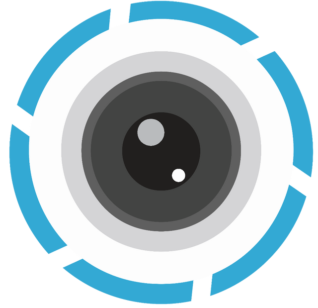

#  

This is a Full Stack MERN Social Media App created for learning purposes. 
It provides authentication via Email and Google.
A User can uploade their memories and like posts by others. 
## Features 
- Authentication (Email / Google)
- Pagination
- Filtering
- Liking
- Editing & Deletion

## How to run
### Config
In `./server` create a file `.env` and enter information according to `.env.dist`


### MongoDB
``` powershell
cd server
npm run start_db
```
This starts a local instance of MongoDB in Docker.
Instead you can also use a cloud version of MongoDB. To do so change the Connection URL in `.env` accordingly and skip this step.


### Server 
``` powershell
cd server
npm install
npm start
```

### Client
``` powershell
cd client
npm install --legacy-peer-deps
npm start
```
